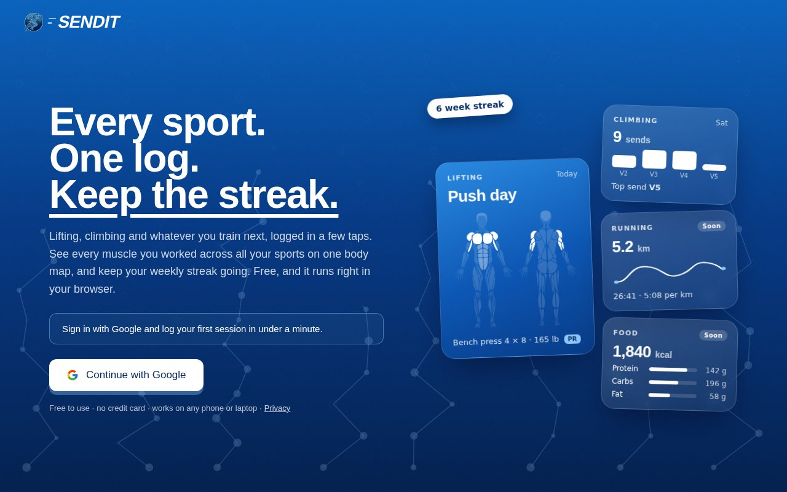
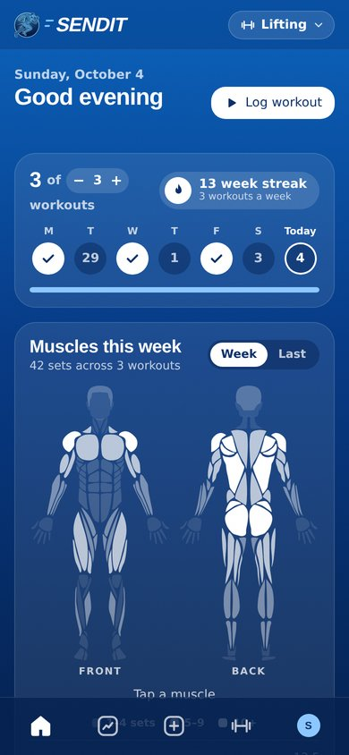
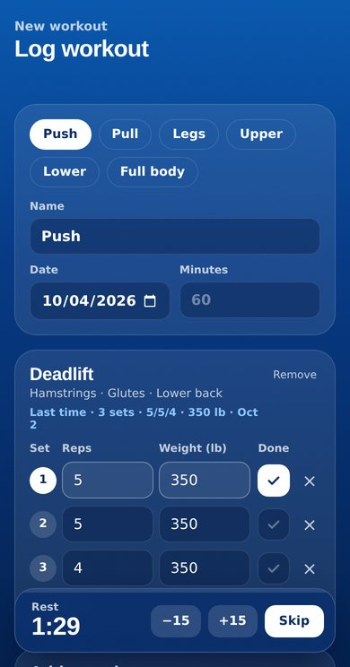
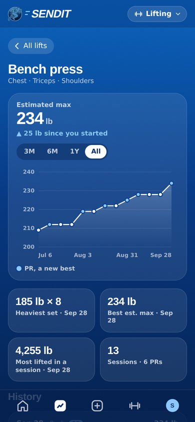
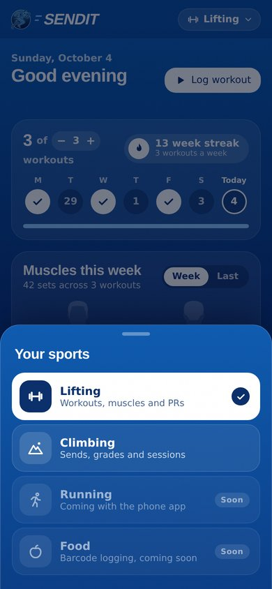

<div align="center">


# Send

**Every sport. One log. Keep the streak.**

A free, multi-sport training log for lifting and climbing, with running and food on the way.
Log a session in a few taps, then see your progress, PRs and every muscle you worked.

[**justsend.fit**](https://justsend.fit) · [Privacy](https://justsend.fit/privacy.html)



</div>

## Why

Most fitness apps cover one sport and charge a premium for the charts. Send puts all of your training in one place, keeps logging fast, and focuses on the analytics that tell you whether you are getting stronger.

## Screenshots

<table>
  <tr>
    <td align="center"><br><sub>Weekly streak and muscle map</sub></td>
    <td align="center"><br><sub>Fast logging with a rest timer</sub></td>
    <td align="center"><br><sub>Per-lift progress and PRs</sub></td>
    <td align="center"><br><sub>Pick your sports</sub></td>
  </tr>
</table>

## Features

**Lifting**
- Workout logger with templates (push, pull, legs and more), "last time" hints and a built-in rest timer
- Searchable library of 95 exercises, each mapped to the muscles it works
- Front and back body map of the muscles you trained this week or last
- Weekly goal with a streak counter
- Progress tab: recent PRs, estimated one-rep max per lift (Epley), charts over 3 months to all time

**Climbing**
- Log climbs by grade, style, wall angle, hold type and attempts
- Analytics on sends, grades and sessions

**Everywhere**
- Sport switcher so you only see the sports you do
- Google sign-in, with each person's data private to them (Postgres row-level security)
- Installable on a phone home screen as an app (PWA), with offline-friendly caching
- Optional AI coach (signed-in users, 10 questions a day) and a climbing news feed

**Coming next:** food logging by barcode, running through a native phone app with Apple Health and Google Health Connect.

## Tech stack

| Part | What |
| --- | --- |
| Frontend | React 19, Vite, plain CSS ("Ocean dark" theme) |
| Auth and database | Supabase (Google OAuth, Postgres with row-level security) |
| Serverless API | Vercel functions in `api/` (AI coach, news, videos) |
| AI coach | Google Gemini |
| Hosting | Vercel, deploying `main` to [justsend.fit](https://justsend.fit) |
| CI | GitHub Actions build check on every pull request |

## Project layout

```
api/          Vercel serverless functions (coach, news, youtube)
public/       PWA manifest, service worker, icons, privacy page
src/          React app (lifting, climbing, progress, navigation)
supabase/     SQL to run in the Supabase SQL Editor
docs/         README screenshots
```

## Run it locally

You need Node 22 and npm.

```bash
git clone https://github.com/SuryaHarikrishnan/send-ai.git
cd send-ai
npm install
npm run dev
```

Open the address Vite prints. The app talks to the Supabase project configured in `src/supabase.js`; to use your own, replace the URL and publishable (anon) key there. Those two values are safe to ship in the browser because row-level security protects the data.

The `api/` functions only run on Vercel. To try them locally, use `vercel dev` with the environment variables below.

Other scripts: `npm run build` (production build into `dist/`), `npm run preview` (serve that build), `npm run lint`.

## Environment variables

Set these in the Vercel project settings (never commit them):

| Variable | Used by | Required |
| --- | --- | --- |
| `GEMINI_API_KEY` | AI coach (`api/coach.js`) | For the coach |
| `NEWS_API_KEY` | News feed (`api/news.js`) | For news |
| `YOUTUBE_API_KEY` | Videos (`api/youtube.js`) | For videos |
| `SUPABASE_URL`, `SUPABASE_ANON_KEY` | Coach sign-in check | No, defaults to the project in `src/supabase.js` |

## Database setup

Run each file in `supabase/` once in the Supabase dashboard (SQL Editor, New query, paste, Run). Both are safe to run again.

1. `supabase/lockdown.sql` turns on row-level security for `climbs` and creates `coach_requests` (the coach's daily limit).
2. `supabase/workouts.sql` creates the `workouts` table for lifting.

The `climbs` table predates these scripts. On a fresh Supabase project, create it first with `id`, `user_id` (references `auth.users`), `grade`, `style`, `wall_angle`, `hold_type`, `attempts`, `sent`, `notes` and `created_at`.

Any new table needs row-level security, `grant select, insert, update, delete ... to authenticated`, and `notify pgrst, 'reload schema'`, or the app cannot read it.

Google sign-in is configured in Supabase under Authentication, Providers, Google, with the site URL and redirect set to your domain.

## Deploying

Vercel is connected to this repository. Every merge to `main` deploys to [justsend.fit](https://justsend.fit); pull requests get a preview build and must pass the GitHub Actions build check.

Note: Supabase's free plan pauses a project after about a week without activity. If sign-in stops working, restore the project from the Supabase dashboard.
